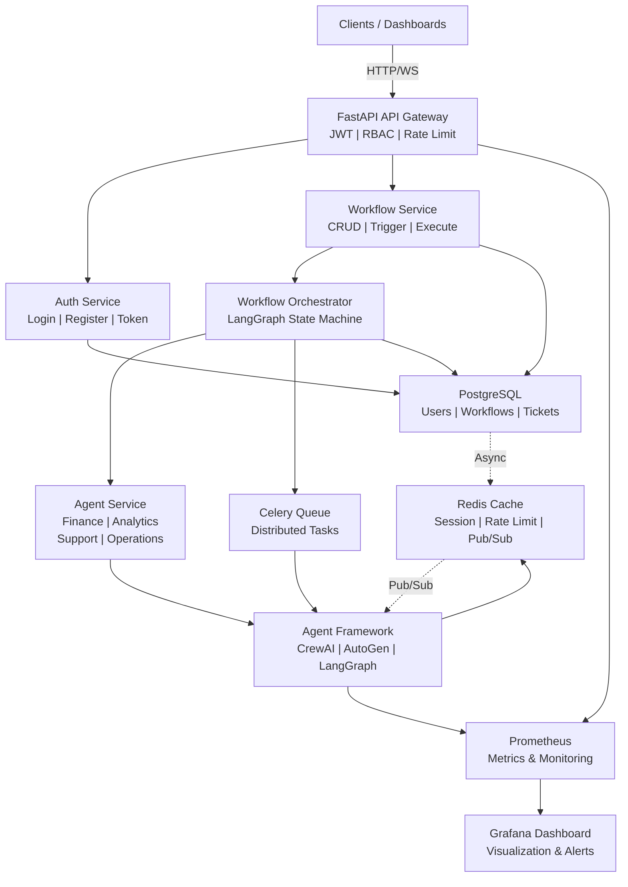
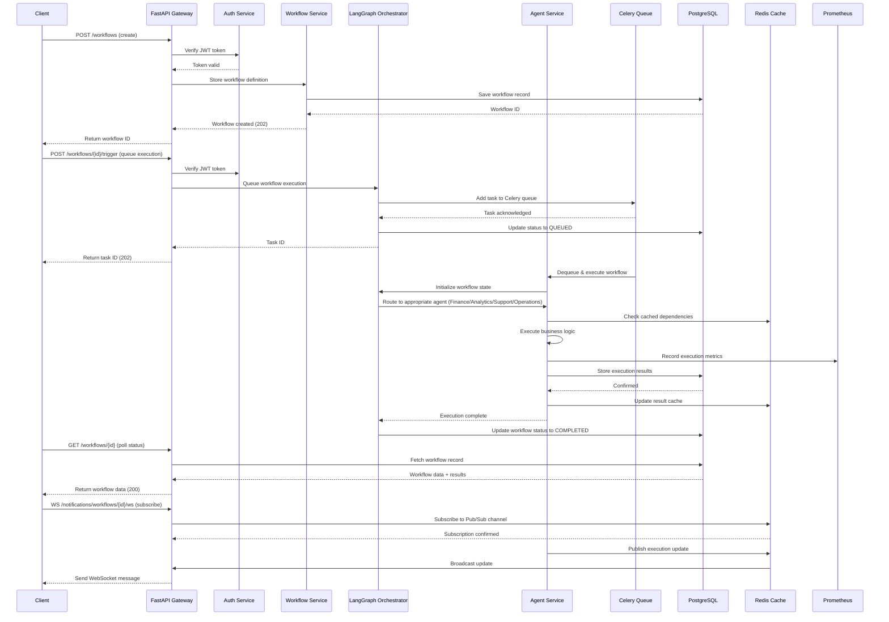
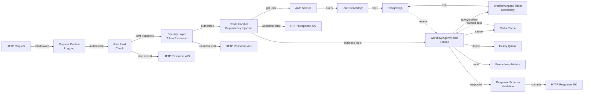
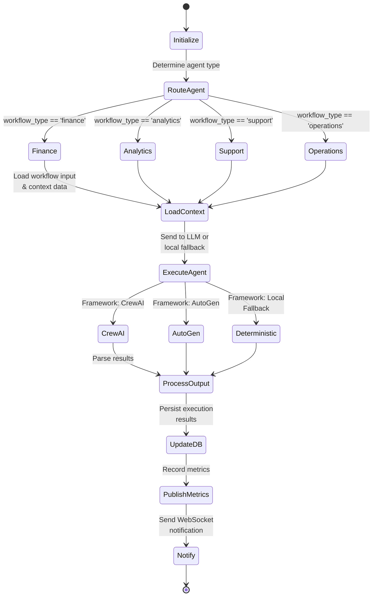

# Multi-Agent Business Automation System

Production-oriented backend platform for finance, analytics, operations, and customer support automation using autonomous agents coordinated through FastAPI, LangGraph, CrewAI, AutoGen, PostgreSQL, Redis, Celery, Prometheus, and Grafana.

## Architecture



The code is organized around thin API routers, service-layer business logic, repository-based persistence, and framework adapters for CrewAI, LangGraph, AutoGen, and LangChain-friendly future tooling.

## Features

- JWT authentication with role-based access control: Admin, Manager, Analyst, Support Executive
- Workflow CRUD plus trigger, inline execute, pause, resume, retry, and execution history
- Finance, analytics, support, and operations agents with autonomous delegation
- LangGraph execution graph with conditional routing and parallel async agent execution
- CrewAI and AutoGen adapters with graceful local fallbacks
- PostgreSQL persistence through SQLAlchemy async sessions and Alembic migrations
- Redis for rate limiting, Pub/Sub, workflow state cache, and Celery broker/backend
- Celery workers for distributed background execution
- Prometheus `/metrics`, structured JSON logs, health and readiness endpoints
- Docker Compose for local and production deployment
- Grafana dashboard provisioning
- Kubernetes starter manifests and GitHub Actions CI

## API Surface

All versioned endpoints are mounted under `/api/v1`.

- `POST /auth/register`
- `POST /auth/login`
- `GET /auth/me`
- `POST /workflows`
- `GET /workflows`
- `GET /workflows/{id}`
- `PUT /workflows/{id}`
- `DELETE /workflows/{id}`
- `POST /workflows/{id}/trigger`
- `POST /workflows/{id}/execute`
- `POST /workflows/{id}/pause`
- `POST /workflows/{id}/resume`
- `POST /workflows/{id}/retry`
- `GET /agents`
- `GET /agents/{id}`
- `POST /agents/execute`
- `GET /analytics/overview`
- `GET /analytics/workflow-metrics`
- `GET /analytics/agent-performance`
- `POST /tickets`
- `GET /tickets`
- `PUT /tickets/{id}`
- `WS /notifications/workflows/{workflow_id}/ws`
- `GET /health`
- `GET /ready`

Swagger UI is available at `/docs`.

## Local Deployment

```bash
cp .env.example .env
docker-compose up --build
```

Run migrations:

```bash
docker-compose exec backend alembic upgrade head
```

Access services:

- FastAPI: http://localhost:8000
- Swagger: http://localhost:8000/docs
- Prometheus: http://localhost:9090
- Grafana: http://localhost:3000

Grafana defaults to `admin` / `admin` locally.

## Example Requests

Register a user:

```bash
curl -X POST http://localhost:8000/api/v1/auth/register \
  -H "Content-Type: application/json" \
  -d '{"name":"Admin","email":"admin@example.com","password":"password123","role":"admin"}'
```

Login:

```bash
curl -X POST http://localhost:8000/api/v1/auth/login \
  -H "Content-Type: application/json" \
  -d '{"email":"admin@example.com","password":"password123"}'
```

Create a finance workflow:

```bash
curl -X POST http://localhost:8000/api/v1/workflows \
  -H "Authorization: Bearer <token>" \
  -H "Content-Type: application/json" \
  -d '{
    "workflow_name": "Monthly Expense Review",
    "workflow_type": "finance",
    "input_payload": {
      "expenses": [{"amount": 200}, {"amount": 1200}, {"amount": 250}],
      "include_forecast": true
    }
  }'
```

Queue workflow execution:

```bash
curl -X POST http://localhost:8000/api/v1/workflows/<workflow_id>/trigger \
  -H "Authorization: Bearer <token>"
```

Execute immediately without Celery:

```bash
curl -X POST http://localhost:8000/api/v1/workflows/<workflow_id>/execute \
  -H "Authorization: Bearer <token>"
```

## Production Deployment

Configure `.env` with production values:

```env
ENVIRONMENT=production
DATABASE_URL=postgresql://postgres:password@db:5432/automation_db
REDIS_URL=redis://redis:6379/0
SECRET_KEY=replace_with_a_long_random_production_secret
OPENAI_API_KEY=your_openai_key
```

Start the production stack:

```bash
docker-compose -f docker-compose.prod.yml up -d --build
docker-compose -f docker-compose.prod.yml exec backend alembic upgrade head
```

For HTTPS, point a host at the VPS and terminate TLS with Certbot/Nginx:

```bash
sudo apt update
sudo apt install docker.io docker-compose nginx certbot python3-certbot-nginx
sudo certbot --nginx
```

## Kubernetes

Build and publish the image, create an `automation-secrets` Kubernetes secret with the environment variables, then apply:

```bash
kubectl apply -f k8s/
kubectl get pods
kubectl get services
```

## Development

Install dependencies locally:

```bash
python -m venv .venv
. .venv/Scripts/activate
pip install -r requirements.txt
```

Run checks:

```bash
ruff check app tests
pytest -q
```

Run the API locally:

```bash
uvicorn app.main:app --reload
```

Run a worker locally:

```bash
celery -A app.tasks.celery_app worker --loglevel=INFO -Q workflows
```

## File Structure

```
multi-agent-business-automation-system-build/
├── app/                          # Main application package
│   ├── main.py                   # FastAPI app initialization & middleware setup
│   ├── tasks.py                  # Celery task definitions for distributed execution
│   ├── api/                      # API route handlers
│   │   ├── v1/
│   │   │   ├── router.py         # Main router - mounts all v1 endpoints
│   │   │   ├── auth.py           # Authentication endpoints (login, register, me)
│   │   │   ├── workflows.py      # Workflow CRUD & execution (trigger, pause, resume)
│   │   │   ├── agents.py         # Agent registry & execution
│   │   │   ├── analytics.py      # Analytics & metrics endpoints
│   │   │   ├── tickets.py        # Support ticket management
│   │   │   ├── notifications.py  # WebSocket notifications
│   │   │   └── health.py         # Health & readiness checks
│   │   └── deps.py               # Dependency injection & security
│   ├── agents/                   # AI Agent implementations
│   │   ├── base.py               # Abstract base agent class
│   │   ├── finance.py            # Finance automation agent
│   │   ├── analytics.py          # Analytics agent
│   │   ├── support.py            # Support & ticket agent
│   │   ├── operations.py         # Operations automation agent
│   │   ├── registry.py           # Agent registry & factory
│   │   ├── crew_adapter.py       # CrewAI framework adapter
│   │   └── autogen_adapter.py    # AutoGen framework adapter
│   ├── workflows/                # Workflow orchestration (LangGraph)
│   │   ├── state.py              # Workflow state definitions
│   │   └── langgraph_orchestrator.py  # LangGraph state machine & routing
│   ├── services/                 # Business logic layer
│   │   ├── auth_service.py       # Authentication & JWT logic
│   │   ├── workflow_service.py   # Workflow management logic
│   │   ├── agent_service.py      # Agent execution & coordination
│   │   ├── analytics_service.py  # Analytics aggregation
│   │   ├── ticket_service.py     # Support ticket processing
│   │   └── notification_service.py # Real-time notifications
│   ├── repositories/             # Data access layer (Repository pattern)
│   │   ├── base.py               # Generic async repository base
│   │   ├── users.py              # User CRUD operations
│   │   ├── workflows.py          # Workflow persistence
│   │   ├── agents.py             # Agent metadata storage
│   │   ├── tickets.py            # Support ticket storage
│   │   └── analytics.py          # Analytics data queries
│   ├── models/                   # SQLAlchemy ORM models
│   │   ├── user.py               # User model with roles
│   │   ├── workflow.py           # Workflow definition & execution tracking
│   │   ├── workflow_task.py      # Workflow task steps
│   │   ├── agent.py              # Agent metadata
│   │   ├── support_ticket.py     # Support ticket model
│   │   ├── analytics_report.py   # Analytics report storage
│   │   └── enums.py              # Status, role, and type enums
│   ├── schemas/                  # Pydantic request/response models
│   │   ├── auth.py               # Auth request/response schemas
│   │   ├── user.py               # User schemas
│   │   ├── workflow.py           # Workflow request/response schemas
│   │   ├── agent.py              # Agent schemas
│   │   ├── ticket.py             # Ticket schemas
│   │   ├── analytics.py          # Analytics schemas
│   │   └── common.py             # Common/shared schemas
│   ├── core/                     # Configuration & utilities
│   │   ├── config.py             # Settings from environment
│   │   ├── security.py           # JWT token & password hashing
│   │   ├── logging.py            # Structured JSON logging
│   │   └── exceptions.py         # Custom exception types
│   ├── db/                       # Database & cache setup
│   │   ├── session.py            # SQLAlchemy async session factory
│   │   ├── base.py               # Declarative base & metadata
│   │   └── redis.py              # Redis connection & utilities
│   ├── middleware/               # HTTP middleware
│   │   ├── request_context.py    # Request context tracking
│   │   └── rate_limit.py         # Rate limiting middleware
│   ├── monitoring/               # Observability
│   │   └── metrics.py            # Prometheus metrics definitions
│   └── utils/                    # Utility functions
├── alembic/                      # Database migrations (SQLAlchemy)
│   ├── versions/                 # Migration scripts
│   └── env.py                    # Migration configuration
├── tests/                        # Unit & integration tests
│   ├── test_*.py                 # Test modules
│   └── conftest.py               # Pytest fixtures
├── docker/                       # Docker build scripts
│   └── Dockerfile.*.txt          # Service-specific Dockerfiles (optional)
├── k8s/                          # Kubernetes manifests
│   ├── deployment.yaml           # FastAPI deployment
│   ├── worker.yaml               # Celery worker deployment
│   ├── service.yaml              # Service exposure
│   ├── ingress.yaml              # Ingress routing
│   ├── configmap.yaml            # Environment configuration
│   └── secrets.yaml              # Secret management
├── nginx/                        # Nginx reverse proxy config
│   └── nginx.conf                # Proxy, SSL, routing configuration
├── prometheus/                   # Prometheus configuration
│   └── prometheus.yml            # Metrics scrape config
├── grafana/                      # Grafana provisioning
│   ├── provisioning/dashboards/  # Dashboard JSON definitions
│   └── provisioning/datasources/ # Data source configurations
├── .github/workflows/            # GitHub Actions CI/CD
│   ├── test.yml                  # Run tests & linting on PR
│   └── deploy.yml                # Deploy on main branch
├── docker-compose.yml            # Local dev environment
├── docker-compose.prod.yml       # Production deployment
├── Dockerfile                    # FastAPI app Docker image
├── pyproject.toml                # Python project config & dependencies
├── requirements.txt              # Python dependencies
├── alembic.ini                   # Alembic configuration
├── .env.example                  # Environment template
├── .gitignore                    # Git ignore rules
└── README.md                     # This file
```

## Execution Workflow



## Request Processing Flow



## Agent Execution Flow



## Notes on AI Frameworks

The platform exposes explicit integration points for:

- **LangGraph**: workflow state transitions, conditional routing, and parallel execution
- **CrewAI**: collaborative business-agent crews with role-based delegation
- **AutoGen**: conversational multi-agent execution with dynamic conversation
- **LangChain**: dependency included for future tool/RAG integrations

The code includes deterministic fallbacks so the backend remains testable and deployable even before external LLM credentials or production agent prompts are configured.
